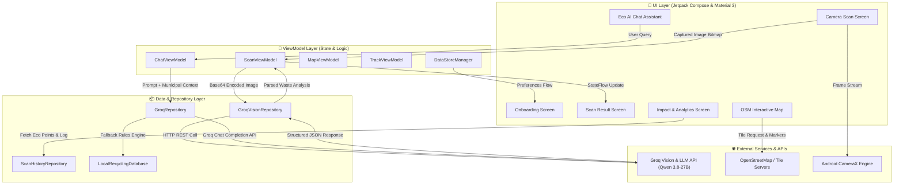

# BinMe ♻️

> **Elevator Pitch**: *BinMe is an AI-powered mobile application that instantly classifies waste using camera vision, locates nearby recycling hubs, and tracks your eco-impact for a cleaner planet.*

---

## 🌟 Key Features

- 📸 **AI Camera Scanner**: Instantly scan waste items using CameraX and Vision AI (`qwen/qwen3.8-27b`) to classify items into *Recyclable*, *Compostable*, *Organic*, *E-Waste*, *Hazardous*, or *Landfill* categories.
- 🗺️ **Interactive Waste & Recycling Map**: Locate nearby public smart bins, recycling hubs, and disposal sites with OpenStreetMap integration (`osmdroid`).
- 💬 **Eco AI Assistant**: Ask questions about waste sorting, recycling rules, and municipal guidelines with an interactive AI chat interface.
- 📊 **Impact Tracker & Analytics**: Monitor your disposal history, track eco-points, and view weekly statistics on waste reduced and carbon footprint savings.
- 💡 **Municipal Sustainability Rules**: Discover municipal recycling guidelines and daily actionable advice for sustainable living.
- 🎨 **Immersive Material 3 UI**: Built entirely with Jetpack Compose, Material Design 3, dynamic theme switching, custom glassmorphism surfaces, and fluid Lottie animations.

---

## 🏗️ System Architecture

BinMe follows modern Android architectural recommendations using **Clean Architecture** principles and the **Unidirectional Data Flow (UDF)** pattern with MVVM (Model-View-ViewModel).



---

## 🏛️ Architectural Breakdown

### 1. **UI Layer (Jetpack Compose & Material Design 3)**
- **Declarative UI**: Built 100% in Kotlin Jetpack Compose without XML layouts.
- **State Driven**: UI components observe immutably exposed `StateFlow` streams from ViewModels.
- **Material 3 Design System**: Custom eco-themed color tokens, dynamic light/dark palettes, custom shapes, and elevated glassmorphism cards.
- **Fluid Micro-Animations**: Powered by `Lottie Compose` for dynamic scan radar animations, success indicators, and loading states.

### 2. **ViewModel Layer (State Management & Logic)**
- **Unidirectional Data Flow (UDF)**: Emits immutable UI States and handles UI Events cleanly via Kotlin `StateFlow` and `SharedFlow`.
- **Coroutine Scope Scoping**: Business operations are executed within `viewModelScope`, ensuring automatic cancellation on lifecycle destruction.

### 3. **Data Layer (Repositories & Sources)**
- **Vision AI Engine (`GroqVisionRepository`)**: Converts camera image frames to compressed Base64 strings and submits multi-modal API prompts to Groq's Vision endpoints. Enforces strict JSON response schemas (`response_format = json_object`).
- **Resilient AI Failover Engine**: If external Vision API requests fail or time out, the app gracefully falls back to a deterministic municipal rules engine (`LocalRecyclingDatabase`).
- **Eco Chat Assistant (`GroqRepository`)**: Interacts with `qwen/qwen3.8-27b` using injected municipal recycling context (Lake Oswego & Clackamas County guidelines) for localized advice.
- **Local Persistence (`DataStoreManager` & `ScanHistoryRepository`)**: Uses Android Jetpack DataStore Preferences for async, non-blocking key-value storage (onboarding state, user preferences) and local file storage for scan logs.

### 4. **GIS & Mapping Layer (`osmdroid`)**
- **Open-Source Mapping**: Uses `osmdroid` for offline-capable, open-source tile rendering without Google Maps API keys.
- **Smart Bin Overlays**: Custom overlays plot nearby municipal disposal centers, smart waste bins, and electronic recycling stations dynamically.

---

## 🛠️ Technical Stack & Dependencies

| Layer / Domain | Technology & Libraries |
| :--- | :--- |
| **Language** | Kotlin (100%) |
| **UI Framework** | Jetpack Compose + Material Design 3 |
| **Architecture** | MVVM, Clean Architecture, Unidirectional Data Flow (UDF) |
| **Async & Streams** | Kotlin Coroutines & `StateFlow` / `SharedFlow` |
| **Camera & Vision** | Android CameraX (`camera-core`, `camera-camera2`, `camera-lifecycle`, `camera-view`) |
| **Network & REST API** | Retrofit 2, OkHttp 3 / 4, Gson Converter, HttpLoggingInterceptor |
| **Vision AI & LLM** | Groq API (`qwen/qwen3.8-27b` multi-modal vision & chat models) |
| **GIS & Maps** | `osmdroid-android` (OpenStreetMap integration) |
| **Local Storage** | Android Jetpack DataStore Preferences |
| **Animations & Media** | Lottie Compose, Coil Compose (Image Loading) |
| **Security** | Gradle `BuildConfig` field injection for local API keys |

---

## ⚡ Technical Highlights & Pipelines

### 📸 CameraX to Vision AI Pipeline
1. **Frame Capture**: `CameraX` captures high-resolution photo data on a background executor.
2. **Compression & Base64 Encoding**: Image bitmap is scaled, compressed to JPEG, and converted to Base64 to optimize network payload size (< 500KB).
3. **Multi-Modal Prompting**: The payload is dispatched via `GroqApiService` with system prompts requiring structured JSON outputs containing `category`, `confidence`, `disposal_instructions`, and `eco_tip`.
4. **Parsing & UI Render**: Response is deserialized, saved to local scan history, and rendered via `BinMeScanResultScreen`.

---

## 📁 Repository Structure

```text
BinMe/
├── app/
│   ├── src/main/java/com/tensormind/binme/
│   │   ├── MainActivity.kt        # Main Entry Point & App Navigation Host
│   │   ├── data/                  # Repositories & Data Layer
│   │   │   ├── LocalRecyclingDatabase.kt # Municipal Rules Engine & Fallbacks
│   │   │   ├── ScanHistoryRepository.kt  # User Scan History Persistence
│   │   │   └── remote/                   # Retrofit API Services & Vision Repos
│   │   │       ├── GroqApiService.kt
│   │   │       ├── GroqVisionRepository.kt
│   │   │       └── CloudflareVisionRepository.kt
│   │   ├── ui/                    # Compose UI Screens & ViewModels
│   │   │   ├── chat/              # Eco AI Chat Assistant
│   │   │   ├── history/           # Disposal Scan History
│   │   │   ├── home/              # Main Dashboard
│   │   │   ├── map/               # OpenStreetMap Smart Bin View
│   │   │   ├── onboarding/        # User Onboarding Pager
│   │   │   ├── scan/              # CameraX Scanner & Result Screens
│   │   │   ├── settings/          # User Settings
│   │   │   ├── theme/             # Color Palette & Material Typography
│   │   │   ├── tips/              # Daily Eco Tips
│   │   │   └── track/             # Impact Analytics & Eco Points
│   │   └── util/                  # Helper Utilities & DataStore Manager
│   └── build.gradle.kts           # Module Build Configurations
├── build.gradle.kts               # Root Build Configuration
└── settings.gradle.kts            # Project Settings
```

---

## 🚀 Getting Started

### Prerequisites

- **Android Studio**: Android Studio Ladybug (2024.2.1) or newer
- **JDK**: Java 11 or higher
- **Minimum SDK**: API 24 (Android 7.0)
- **Target SDK**: API 36 (Android 15)

### Setup Instructions

1. **Clone the Repository**
   ```bash
   git clone https://github.com/your-username/BinMe.git
   cd BinMe
   ```

2. **Configure Environment Keys**
   Create or open `local.properties` in the project root directory and add your Groq API key:
   ```properties
   GROQ_API_KEY=YOUR_GROQ_API_KEY_HERE
   ```
   > ⚠️ **Note**: `local.properties` is strictly git-ignored to protect secret keys.

3. **Build & Run**
   - Open the project in Android Studio.
   - Sync Gradle project dependencies.
   - Run the app on a physical Android device or emulator with camera permissions enabled.

---

## 🔒 Security & Privacy

- Confidential API keys are loaded dynamically into `BuildConfig` at compile time and excluded from version control.
- Scan history and app preferences remain private and stored on-device via Jetpack DataStore.

---

## 📄 License

This project is licensed under the [MIT License](LICENSE).

